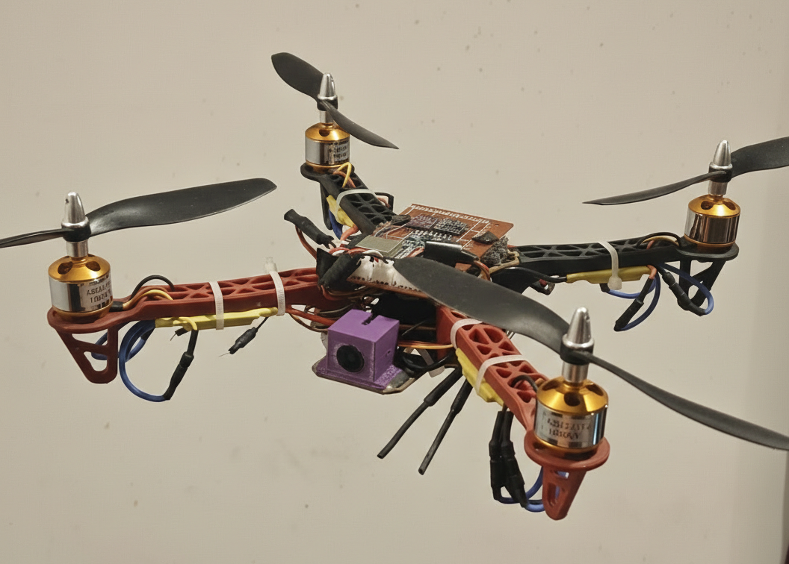
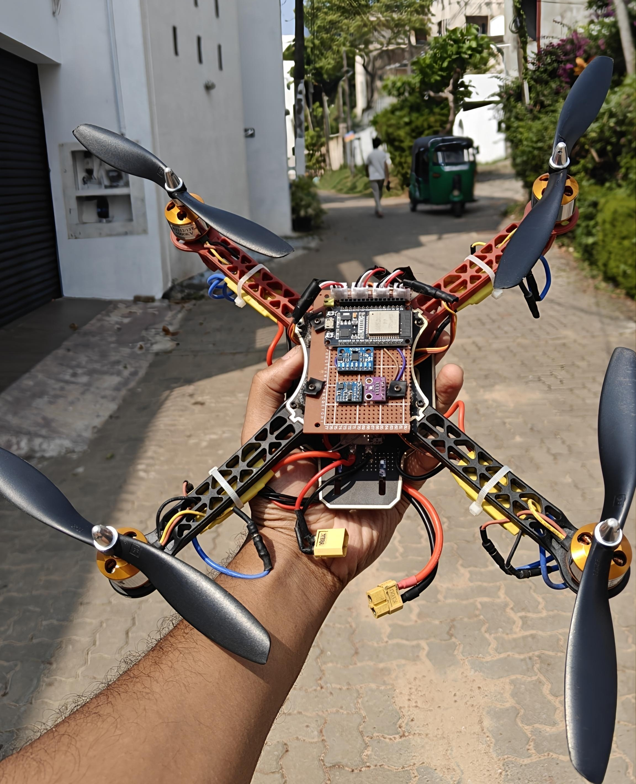

# ESP32 Flight Controller

An implementation of ESP32-based flight control firmware for a quadcopter.

## Hardware

- **MCU:** ESP32 (esp32dev)
- **IMU:** MPU6050 (gyro + accelerometer, I2C)
- **Magnetometer:** HMC5883L (I2C)
- **Receiver:** FlySky FS-IA6B (IBUS)
- **ESCs:** 4x PWM 
- **Frame:** Quadcopter (X configuration)

### Pictures




## Dependencies

- [PlatformIO](https://platformio.org/) (CLI or IDE extension)
- [ESP32Servo](https://github.com/madhephaestus/ESP32Servo) `^0.13.0` — auto-installed by PlatformIO

## Build & Flash

1. Clone the repo and open it in PlatformIO.
2. Edit [`src/Config.h`](src/Config.h) to set your `WIFI_SSID`, `WIFI_PASSWORD`, pin assignments, and tuning values.
3. Connect the ESP32 over USB.
4. Build and upload:
   ```
   pio run -t upload
   ```
5. Open the serial monitor (115200 baud):
   ```
   pio device monitor
   ```
6. Open the telemetry dashboard in a browser at the ESP32's IP address (printed on boot).

## License

MIT License — see [LICENSE](LICENSE).
